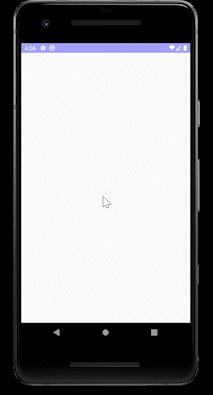
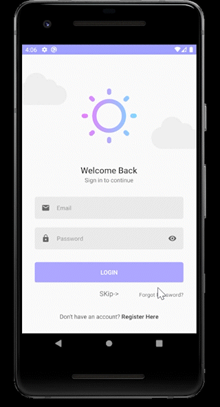
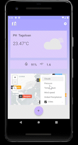

# Weather_friend

In simple words, Weather app is a mobile app developed by Android -“Kotlin language” 
 that informs users about weather, weather forecast and any weather updates
 
# Purpose Weather Friend App
Weather app displays current weather for 200,000 cites also  Live map by “OpenWeatherMap”. The application sends a recommendation to the user that it contains a description of the weather with advice such as "Don't forget the umbrella". The app supports Arabic and English language
##### Video for application -> https://streamable.com/odz2rl
##### Wire Frame Link -> https://www.figma.com/file/EaVeHBncxwntEe96AxqhAb/Untitled?node-id=0%3A1
##### SRS -> https://tuwaiqedusa0-my.sharepoint.com/:w:/g/personal/nadiyah_almurashi_jed_k1_tuwaiq_edu_sa/ESDYH8lrBG1HvHWhOn8Of_gBfJP_lTO_v0Gh1hep2I4l0Q?e=fszYC8
##### Design architecture and Libraries

- Firebase Authentication

- API & Retrofit &RXJava & Gson

- Lifecycle

- Room database -> Save the user's favorite cities 

- Lottie for animation -> for Weather image animation

- Coroutines Library

- Work manager -> for notifications

- Design patterns MVVM 

- Map from “OpenWeatherMap” 

# Weather Friend’s Demo

Account's Demo :Email/nadiaalmrashi@gmail.com - Password/123456

## UI Login/Sign-up/Forget password

&emsp;&emsp;

## UI Weather cites/Edit city

&emsp;&emsp;

## UI Map weather /Setting

&emsp;

